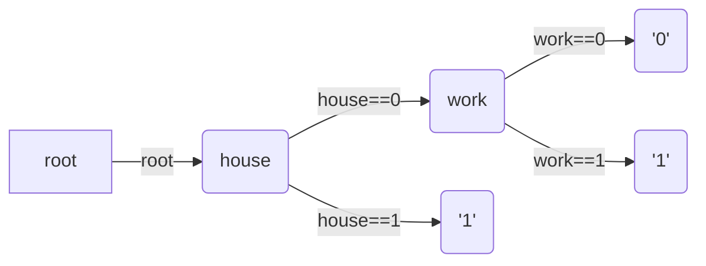
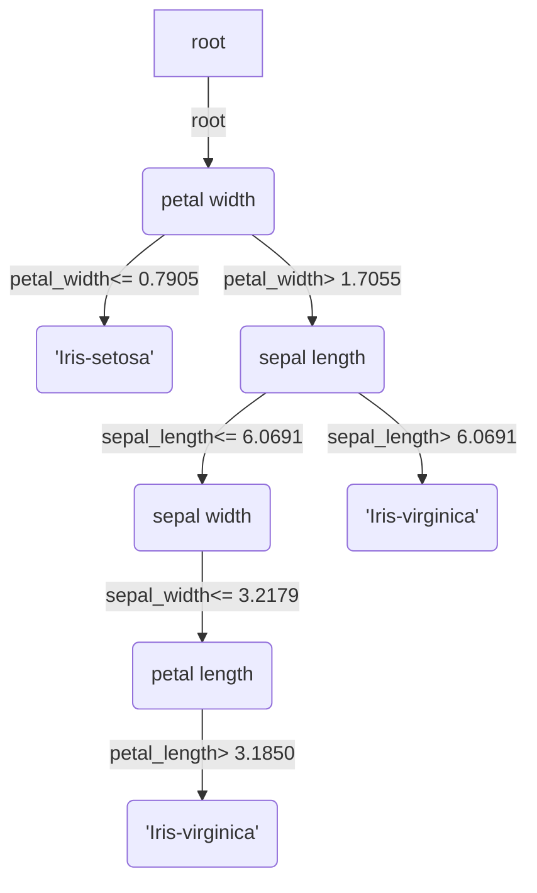

# Decision-Tree
Python implementation of decision tree

```mermaid
graph LR
root--root-->a(house)
a(house)--house==0-->a0(work)
a0(work)--work==0-->a00('0')
a0(work)--work==1-->a01('1')
a(house)--house==1-->a1('1')

```

```mermaid
graph TB
root--root-->a(petal width)
a(petal width)--petal_width<= 0.7905-->a0('Iris-setosa')
a(petal width)--petal_width> 1.7055-->a1(sepal length)
a1(sepal length)--sepal_length<= 6.0691-->a10(sepal width)
a10(sepal width)--sepal_width<= 3.2179-->a100(petal length)
a100(petal length)--petal_length> 3.1850-->a1000('Iris-virginica')
a1(sepal length)--sepal_length> 6.0691-->a11('Iris-virginica')
```

