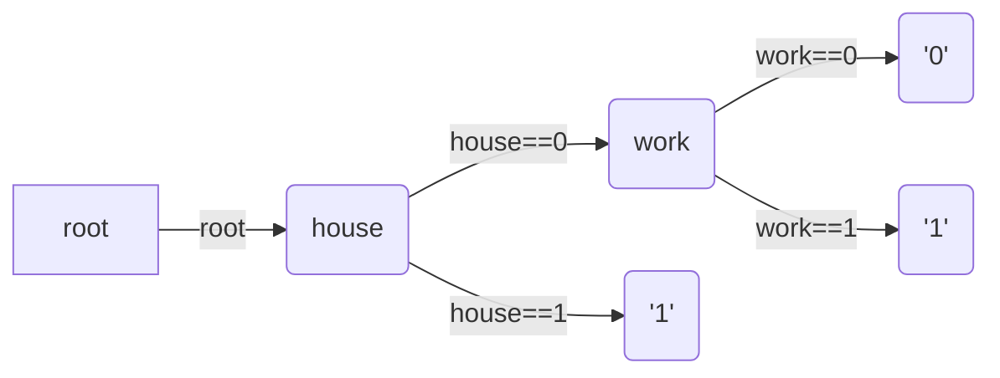
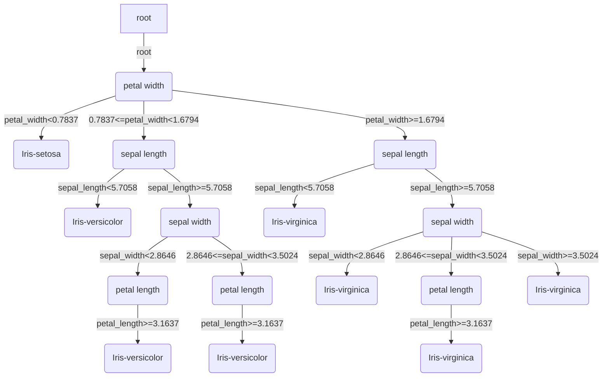
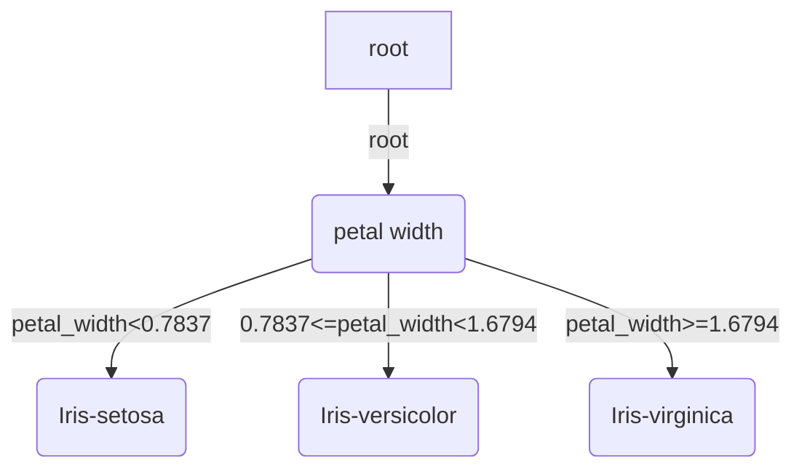

# Decision-Tree
Python implementation of decision tree (algorithm ID3)

## File Structure

`kmeans.py`: k means for 1d data

`entropy.py`: caculate entropy, conditional entropy, empirical entropy and empirical conditional entropy

`decision_tree.py`: node and decision tree

You can visualize something in the jupyter notebook file `visualization.ipynb`

## Dataset 

[Iris](https://archive.ics.uci.edu/ml/datasets/Iris) dataset from UCI machine learning repository

## Usage 

```sh
python main.py
```

you can expect to get the following output in the terminal: 

```sh
Train: 117 samples, Test: 33
Attribute sepal_length has been discretized
Attribute sepal_width has been discretized
Attribute petal_length has been discretized
Attribute petal_width has been discretized


graph TB
root--root-->a(petal width)
a(petal width)--petal_width<0.7837-->a0(Iris-setosa)
a(petal width)--0.7837<=petal_width<1.6794-->a1(sepal length)
a1(sepal length)--sepal_length<5.7058-->a10(Iris-versicolor)
a1(sepal length)--sepal_length>=5.7058-->a11(sepal width)
a11(sepal width)--sepal_width<2.8646-->a110(petal length)
a110(petal length)--petal_length>=3.1637-->a1100(Iris-versicolor)
a11(sepal width)--2.8646<=sepal_width<3.5024-->a111(petal length)
a111(petal length)--petal_length>=3.1637-->a1110(Iris-versicolor)
a(petal width)--petal_width>=1.6794-->a2(sepal length)
a2(sepal length)--sepal_length<5.7058-->a20(Iris-virginica)
a2(sepal length)--sepal_length>=5.7058-->a21(sepal width)
a21(sepal width)--sepal_width<2.8646-->a210(Iris-virginica)
a21(sepal width)--2.8646<=sepal_width<3.5024-->a211(petal length)
a211(petal length)--petal_length>=3.1637-->a2110(Iris-virginica)
a21(sepal width)--sepal_width>=3.5024-->a212(Iris-virginica)

graph TB
root--root-->a(petal width)
a(petal width)--petal_width<0.7837-->a0(Iris-setosa)
a(petal width)--0.7837<=petal_width<1.6794-->a1(Iris-versicolor)
a(petal width)--petal_width>=1.6794-->a2(Iris-virginica)

Predict in test data
     sepal_length  sepal_width  petal_length  petal_width            class       pred_class
6             4.6          3.4           1.4          0.3      Iris-setosa      Iris-setosa
18            5.7          3.8           1.7          0.3      Iris-setosa      Iris-setosa
20            5.4          3.4           1.7          0.2      Iris-setosa      Iris-setosa
24            4.8          3.4           1.9          0.2      Iris-setosa      Iris-setosa
25            5.0          3.0           1.6          0.2      Iris-setosa      Iris-setosa
27            5.2          3.5           1.5          0.2      Iris-setosa      Iris-setosa
36            5.5          3.5           1.3          0.2      Iris-setosa      Iris-setosa
37            4.9          3.1           1.5          0.1      Iris-setosa      Iris-setosa
38            4.4          3.0           1.3          0.2      Iris-setosa      Iris-setosa
52            6.9          3.1           4.9          1.5  Iris-versicolor  Iris-versicolor
61            5.9          3.0           4.2          1.5  Iris-versicolor  Iris-versicolor
63            6.1          2.9           4.7          1.4  Iris-versicolor  Iris-versicolor
64            5.6          2.9           3.6          1.3  Iris-versicolor  Iris-versicolor
66            5.6          3.0           4.5          1.5  Iris-versicolor  Iris-versicolor
69            5.6          2.5           3.9          1.1  Iris-versicolor  Iris-versicolor
71            6.1          2.8           4.0          1.3  Iris-versicolor  Iris-versicolor
80            5.5          2.4           3.8          1.1  Iris-versicolor  Iris-versicolor
133           6.3          2.8           5.1          1.5   Iris-virginica  Iris-versicolor
102           7.1          3.0           5.9          2.1   Iris-virginica   Iris-virginica
103           6.3          2.9           5.6          1.8   Iris-virginica   Iris-virginica
105           7.6          3.0           6.6          2.1   Iris-virginica   Iris-virginica
107           7.3          2.9           6.3          1.8   Iris-virginica   Iris-virginica
112           6.8          3.0           5.5          2.1   Iris-virginica   Iris-virginica
113           5.7          2.5           5.0          2.0   Iris-virginica   Iris-virginica
114           5.8          2.8           5.1          2.4   Iris-virginica   Iris-virginica
120           6.9          3.2           5.7          2.3   Iris-virginica   Iris-virginica
122           7.7          2.8           6.7          2.0   Iris-virginica   Iris-virginica
124           6.7          3.3           5.7          2.1   Iris-virginica   Iris-virginica
131           7.9          3.8           6.4          2.0   Iris-virginica   Iris-virginica
139           6.9          3.1           5.4          2.1   Iris-virginica   Iris-virginica
140           6.7          3.1           5.6          2.4   Iris-virginica   Iris-virginica
141           6.9          3.1           5.1          2.3   Iris-virginica   Iris-virginica
146           6.3          2.5           5.0          1.9   Iris-virginica   Iris-virginica
```

copy the mermaid code to markdown, and you would expect to get the following tree: 






## Reference

* Dua, D. and Graff, C. (2019). UCI Machine Learning Repository [http://archive.ics.uci.edu/ml]. Irvine, CA: University of California, School of Information and Computer Science.
* 李航et al. 统计学习方法. Qing hua da xue chu ban she, 2012.